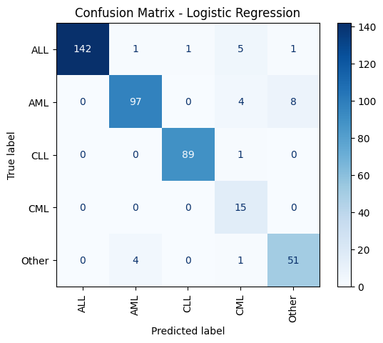

# Leukemia Gene Expression Classification

## Overview

This project aims to classify various leukemia subtypes using high-dimensional gene expression data from microarray experiments. The dataset consists of RNA samples from leukemia patients, processed and normalized to identify meaningful patterns. Multiple machine learning models were evaluated to select the best-performing classifier.

### Achieved Accuracy - 96.9%

---

## Dataset

* **Source:** [GEO: GSE13159](https://ftp.ncbi.nlm.nih.gov/geo/series/GSE13nnn/GSE13159/matrix/GSE13159_series_matrix.txt.gz)
* **Features:** 54,675 gene expression probes
* **Samples:** Patient bone marrow samples with various leukemia subtypes and healthy controls
* **Target Labels:** Leukemia subtypes (ALL, AML, CML, CLL, etc.)

---

## Data Preprocessing Pipeline

1. **Data Loading**

   ```python
   X = pd.read_csv("X.csv", index_col=0)
   y = pd.read_csv("y.csv")["label"]
   ```

2. **Label Normalization**

   * Grouped specific subtypes under broader categories:

     * `ALL` (includes c-ALL, T-ALL, Pro-B-ALL)
     * `AML` (all AML subtypes)
     * `CML`
     * `CLL`
   * Non-leukemia samples kept as separate class.

3. **Feature Scaling**

   ```python
   from sklearn.preprocessing import StandardScaler
   scaler = StandardScaler()
   X_scaled = scaler.fit_transform(X)
   ```

4. **Handling Class Imbalance**

   * Applied SMOTE to oversample minority classes:

   ```python
   from imblearn.over_sampling import SMOTE
   smote = SMOTE(random_state=42)
   X_res, y_res = smote.fit_resample(X_scaled, y)
   ```

5. **Dimensionality Reduction (Optional for Visualization)**

   * PCA used to visualize sample clusters:

   ```python
   from sklearn.decomposition import PCA
   pca = PCA(n_components=2)
   X_pca = pca.fit_transform(X_res)
   ```

---

## Exploratory Data Analysis (EDA)

### Class Distribution wihtout majority classification


### Class Distribution wihtout majority classification


### Top Variable Genes


### PCA Visualization


---

## Machine Learning Models

The following models were evaluated using stratified 5-fold cross-validation:

* Naive Bayes         : 0.908 ± 0.006
* Random Forest       : 0.942 ± 0.011
* KNN                 : 0.916 ± 0.009
* SVM (RBF)           : 0.942 ± 0.009
* Logistic Regression : 0.948 ± 0.011
* Neural Net (MLP)    : 0.964 ± 0.015


### 1. Neural Network (MLP)

* **Best performing model** in this study. Providing with 96.9% accuracy
* Feedforward neural network with one hidden layer.
* Captures non-linear relationships among genes.

```python
from sklearn.neural_network import MLPClassifier
mlp = MLPClassifier(
    hidden_layer_sizes=(21, 78),  
    activation="logistic",         
    solver="adam",              
    max_iter=500,                   
    random_state=69,
    early_stopping=True,
    n_iter_no_change=20
)
mlp.fit(X_train, y_train)
y_pred_mlp = mlp.predict(X_test)
```

## Confusion Matrix


### 2. Logistic Regression

* Linear model suitable for high-dimensional data.
* Output probabilities for multi-class classification.

```python
from sklearn.linear_model import LogisticRegression
log_reg = LogisticRegression(
    max_iter=10000, 
    solver="liblinear", 
    penalty="l2",
    C=1.0,
    random_state=69
)
log_reg.fit(X_train, y_train)
y_pred = log_reg.predict(X_test)
```

## Confusion Matrix



---

## Pipeline Summary

```mermaid
flowchart LR
    A[Raw Gene Expression Data] --> B[Data Cleaning & Label Normalization]
    B --> C[Feature Scaling & SMOTE]
    C --> D[Dimensionality Reduction (PCA)]
    C --> E[Model Training]
    E --> F[Logistic Regression Evaluation]
    E --> G[MLP Evaluation]
    E --> H[XGBoost Evaluation]
    F --> I[Accuracy & Confusion Matrix]
    G --> I
    H --> I
```

---

## How to Run

1. Clone the repository:

```bash
git clone https://github.com/username/leukemia-classification.git
cd leukemia-classification
```

2. Install dependencies:

```bash
pip install -r requirements.txt
```

3. Run the pipeline:

Use jupyter notebook

---

## Conclusion

* Logistic Regression performed best for classifying leukemia subtypes.
* Visualizations confirmed that some subtypes cluster distinctly in PCA space.
* SMOTE improved classification of minority classes.
* Tree-based models (XGBoost) highlighted key genes contributing to subtype differentiation.

---

## Future Work

* Integrate more datasets for cross-validation (e.g., GSE13159).
* Explore deep learning models with multiple hidden layers.
* Conduct pathway analysis on top-ranked genes.

---

## References

1. [GEO Dataset: GSE13159](https://www.ncbi.nlm.nih.gov/geo/query/acc.cgi?acc=GSE13159)
2. Pedregosa et al., *Scikit-learn: Machine Learning in Python*, JMLR 2011.
3. Chen & Guestrin, *XGBoost: A Scalable Tree Boosting System*, KDD 2016.
